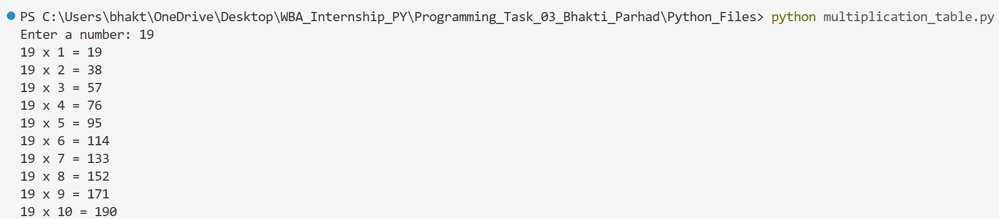
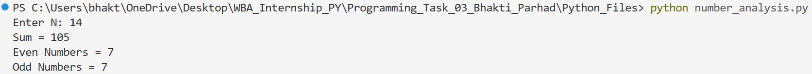
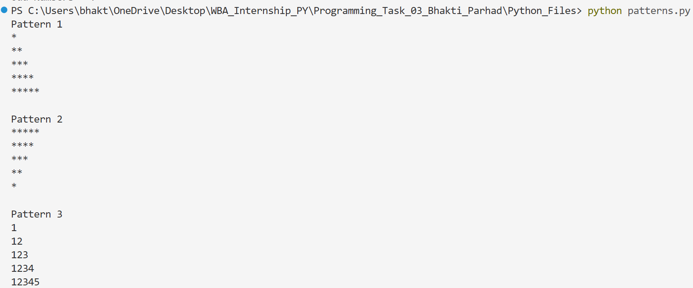
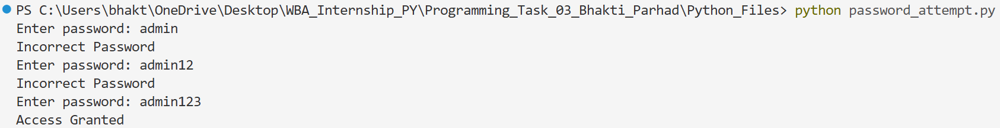
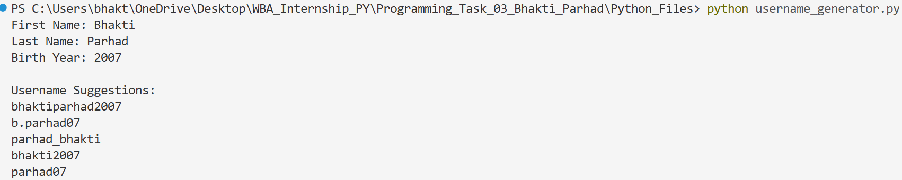
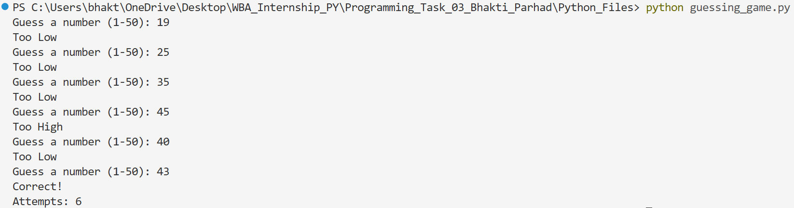

# Programming Task 03 - Loops, Patterns & Basic Automation

## Overview

This repository contains solutions for **Task 03: Loops, Patterns & Basic Automation** implemented in Python.

The objective of this task is to improve logical thinking, problem-solving abilities, and understanding of loops, pattern printing, string manipulation, conditional statements, and basic automation concepts.

---

# Python Programs

## 1. Multiplication Table Generator

### Description

This program accepts a number from the user and displays its multiplication table from 1 to 10 using a for loop.

### Concepts Used

* User Input
* for Loop
* Arithmetic Operations

### Output



---

## 2. Number Analysis Tool

### Description

This program accepts a number N from the user and calculates:

* Sum of numbers from 1 to N
* Count of even numbers
* Count of odd numbers

### Concepts Used

* Loops
* Conditional Statements
* Counters
* Arithmetic Operations

### Output



---

## 3. Pattern Printing Challenge

### Description

This program prints different star and number patterns using nested loops.

### Patterns Included

#### Pattern 1

```text
*
**
***
****
*****
```

#### Pattern 2

```text
*****
****
***
**
*
```

#### Pattern 3

```text
1
12
123
1234
12345
```

### Concepts Used

* Nested Loops
* Pattern Printing
* Iteration

### Output



---

## 4. Password Attempt Simulator

### Description

This program simulates a simple login system by storing a predefined password and allowing a maximum of three login attempts.

### Concepts Used

* while Loop
* Conditional Statements
* Basic Authentication Logic

### Output



---

## 5. Username Generator

### Description

This program generates multiple username suggestions using the user's first name, last name, and birth year.

### Concepts Used

* String Manipulation
* String Concatenation
* User Input

### Output



---

## 6. Number Guessing Game (Bonus)

### Description

This program generates a random number between 1 and 50. The user continues guessing until the correct number is found, and the total number of attempts is displayed.

### Concepts Used

* Random Module
* while Loop
* Conditional Statements
* User Input

### Output



---

# Concepts Learned

* for Loops
* while Loops
* Nested Loops
* Conditional Statements
* String Manipulation
* User Input Handling
* Pattern Printing
* Basic Authentication Logic
* Problem Solving
* Basic Automation

---

# Author

**Bhakti Parhad**

Cyber Security Student | Learning Linux, Networking, Python and Cyber Security Fundamentals
